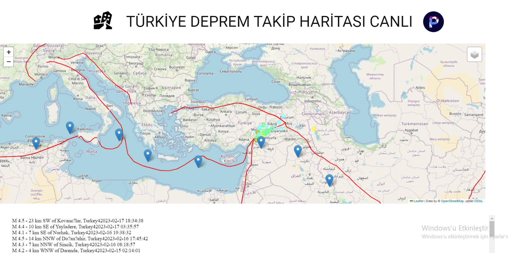

# Canlı-Deprem-Haritası
Canlı Deprem Haritası usgs deprem verilerini kullanarak Türkiye üzerinde olan depremleri python ile işleyip harita üzerinde kullanıcılara sunan bir program.<br>
Canlı Deprem Haritası merkez üssü Kahramanmaraşta yaşanan 7 büyüklüğündeki depremin anısına oluşturulmuştur.
## Görseller
<br>
Görseldeki harita ve altta bulunan depremler kendini güncellemektedir.


## Özellikler
- Harita üzerinde fay hatları.
- Harita üzerinde dakikalık deprem bilgisi.
- Dakikalık depremlerin büyüklükleri,yerleri vb.
- 1 Dakika aralıklar ile güncellenen deprem verileri.

## Kurulum
```py
pip install folium
pip install pandas
pip install time
pip install requests
pip install geopandas
pip install os
pip install webbrowser
pip install keyboard
```
# Kullanım
```py
python3 depremler.py
python3 index2.py
```
Ayrı komut pencerelerinde başlatınız.<br>
Her iki komut penceresindede **Çalışıyor** Yazısını gördükten sonra **Site/index.html** Sayfasını aça bilirsiniz.

# Destek Talebi
Her hanigi bir sorunuz veya takıldığınız bir yer var ise eminnesatg@gmail.com adresinden bana ulaşa bilir veya bir talep oluştura bilirsiniz.

# Katkı
Katkıda bulunmak için [Burayı](https://opensource.guide/tr/how-to-contribute/) gözden geçirerek katkıda buluna bilirsiniz.

# Yol Haritası
-Arayüz geliştirilecek
-Kendi deprem api si geliştirilecek
# Yazalar ve katkıda bulunanlar
Peyxw
# Lisans
``` 
MIT License

Copyright (c) 2023 Emin

Permission is hereby granted, free of charge, to any person obtaining a copy
of this software and associated documentation files (the "Software"), to deal
in the Software without restriction, including without limitation the rights
to use, copy, modify, merge, publish, distribute, sublicense, and/or sell
copies of the Software, and to permit persons to whom the Software is
furnished to do so, subject to the following conditions:

The above copyright notice and this permission notice shall be included in all
copies or substantial portions of the Software.

THE SOFTWARE IS PROVIDED "AS IS", WITHOUT WARRANTY OF ANY KIND, EXPRESS OR
IMPLIED, INCLUDING BUT NOT LIMITED TO THE WARRANTIES OF MERCHANTABILITY,
FITNESS FOR A PARTICULAR PURPOSE AND NONINFRINGEMENT. IN NO EVENT SHALL THE
AUTHORS OR COPYRIGHT HOLDERS BE LIABLE FOR ANY CLAIM, DAMAGES OR OTHER
LIABILITY, WHETHER IN AN ACTION OF CONTRACT, TORT OR OTHERWISE, ARISING FROM,
OUT OF OR IN CONNECTION WITH THE SOFTWARE OR THE USE OR OTHER DEALINGS IN THE
SOFTWARE.
```
# Proje durumu
Geliştirilmeye devam ediliyor
